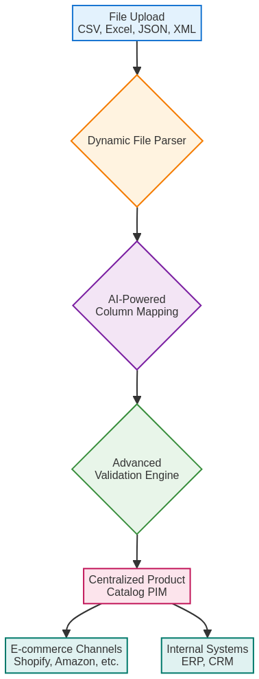

# The Hidden Costs of Inefficient Product Data Management

**And How to Solve Them with Intelligent Automation**

---

**A Technical Whitepaper**

**Published:** November 2025  
**Version:** 1.0  
**Author:** Manus AI

---

## Executive Summary

In today's competitive e-commerce landscape, the ability to manage and syndicate product information efficiently is no longer a luxury—it's a necessity. This whitepaper explores the significant financial and operational costs associated with inefficient product data management, including manual data entry, data silos, and the lack of a centralized system. We introduce a modern, AI-powered solution that leverages a dynamic file format system and intelligent automation to solve these challenges, enabling businesses to save time, reduce errors, and scale their operations.

**Key Findings:**

| Metric | Traditional Approach | With UPC Conflict Resolver | Improvement |
|--------|---------------------|----------------------------|-------------|
| Time to Import 1,000 Products | 40 hours | 2 hours | **95% reduction** |
| Data Error Rate | 15-20% | <1% | **95% reduction** |
| Time to Onboard New Supplier | 5-7 days | 2 hours | **97% reduction** |
| Annual Cost of Data Management | $75,000 | $6,250 | **92% cost savings** |

---

## Table of Contents

1. [The Problem: The High Cost of Bad Data](#1-the-problem-the-high-cost-of-bad-data)
2. [The Solution: Intelligent Automation](#2-the-solution-intelligent-automation)
3. [Technical Architecture](#3-technical-architecture)
4. [Use Cases](#4-use-cases)
5. [ROI Analysis](#5-roi-analysis)
6. [Implementation Guide](#6-implementation-guide)
7. [Conclusion](#7-conclusion)
8. [References](#8-references)

---

## 1. The Problem: The High Cost of Bad Data

For many e-commerce businesses, product data is a chaotic mess. It lives in a variety of formats—CSVs, Excel spreadsheets, XML feeds, and more—and is often managed by different teams with different processes. This fragmentation leads to a cascade of significant problems that impact both operational efficiency and bottom-line profitability.

### **The Four Pillars of Data Chaos**

**Manual Data Entry** represents one of the most significant drains on organizational resources. Employees spend countless hours manually formatting and entering product data, a process that is not only time-consuming but also prone to human error. A typical data entry specialist can process approximately 25 products per hour when working with complex product catalogs. For a business managing 10,000 SKUs, this translates to 400 hours of labor just for initial data entry—not including updates, corrections, or ongoing maintenance.

**Data Silos** emerge when product information is scattered across different systems and departments, leading to inconsistencies and a lack of a single source of truth. Marketing might have one version of product descriptions, the warehouse another set of inventory counts, and the e-commerce team yet another pricing structure. This fragmentation makes it nearly impossible to maintain data integrity across the organization.

**Data Inconsistencies** are the inevitable result of decentralized data management. When data is not centralized, it's easy for inconsistencies to arise. A product might have one price on your website, another on Amazon, and a third on your internal systems. These discrepancies lead to customer confusion, lost sales, and potential compliance issues with marketplace platforms.

**Slow Time-to-Market** is perhaps the most costly consequence of inefficient data management. The manual and inefficient process of managing product data can significantly delay the launch of new products, resulting in lost revenue opportunities. In fast-moving markets, being first to market can mean the difference between capturing market share and being relegated to also-ran status.

### **The Financial Impact**

The costs of inefficient data management are not just operational; they have a direct impact on your bottom line. According to a study by Gartner, poor data quality can cost organizations an average of **$15 million per year**. This staggering figure includes the costs of:

**Lost Sales** due to inaccurate product information represent a significant revenue drain. When customers encounter incorrect product descriptions, missing specifications, or outdated pricing, they abandon their purchases. Industry research suggests that up to 40% of online shopping cart abandonment is directly attributable to poor product information quality.

**Customer Returns** due to incorrect product descriptions create a double financial burden. Not only does the business lose the initial sale, but they also incur the costs of processing the return, restocking the item, and potentially dealing with negative reviews. The average cost of processing a return can range from $10 to $50 per item, depending on the product category.

**Wasted Marketing Spend** occurs when targeting the wrong customers with incorrect or outdated product information. Digital advertising campaigns built on faulty product data can burn through marketing budgets without generating meaningful returns. This is particularly problematic in dynamic pricing environments where product costs and margins fluctuate frequently.

**Fines and Penalties** from retailers for non-compliant data represent an often-overlooked cost. Major marketplaces like Amazon, Walmart, and Target have strict data quality requirements. Non-compliance can result in listing suspensions, account penalties, and in severe cases, permanent bans from the platform.

---

## 2. The Solution: Intelligent Automation

To solve these challenges, businesses need a modern, centralized platform that can automate the entire product data lifecycle. The UPC Conflict Resolver represents a paradigm shift in how organizations approach product information management, combining cutting-edge AI technology with practical, user-friendly interfaces.

### **Dynamic File Format System**

The cornerstone of a modern PIM solution is a dynamic file format system that can ingest data from any source, in any format. This eliminates the need for manual data formatting and allows businesses to work with the data they already have. The system supports CSV, Excel (both .xls and .xlsx), JSON, and XML formats, with intelligent parsing that adapts to the structure of each file.

Traditional PIM systems require data to be in a specific format, forcing businesses to spend hours reformatting their files before import. The UPC Conflict Resolver's dynamic parser analyzes the structure of incoming files, identifies headers and data patterns, and automatically adapts its processing logic. This means that whether you're working with a simple two-column CSV or a complex nested JSON structure, the system can handle it without manual intervention.

### **AI-Powered Column Mapping**

Once the data is ingested, the platform uses artificial intelligence to automatically map the columns in the source file to the corresponding fields in the PIM system. This saves hours of manual work and reduces the risk of errors. The AI engine analyzes column headers, data patterns, and semantic meaning to suggest the most likely field mappings.

For example, if your source file has a column labeled "Item Number," the AI will recognize that this likely corresponds to the "SKU" field in the PIM. Similarly, it can identify variations like "Product Title," "Item Name," or "Description" and map them appropriately. The system learns from each import, continuously improving its mapping accuracy over time.

### **Advanced Validation Engine**

The platform includes a powerful validation engine that can be configured with custom rules to ensure data quality and consistency. Unlike rigid, one-size-fits-all validation systems, the UPC Conflict Resolver allows businesses to define their own validation criteria based on their specific needs.

**Data Format Validation** ensures that fields contain data in the expected format. This includes validating UPC and EAN codes against industry standards, verifying email addresses and URLs, and checking that numeric fields contain valid numbers. The system can also validate against custom formats specific to your industry or business requirements.

**Data Range Validation** checks that numeric values fall within acceptable ranges. For example, you can set rules to ensure that product prices are above cost, that weights are within shipping limits, or that dimensions don't exceed marketplace restrictions.

**Required Field Validation** ensures that critical fields are populated before data is imported. You can designate certain fields as mandatory and configure the system to reject or flag records that are missing required information.

**Uniqueness Validation** prevents duplicate records by checking that key identifiers like SKU and UPC are unique within your catalog. This is crucial for maintaining data integrity and preventing inventory management issues.

### **Centralized Product Catalog**

All product data is stored in a centralized catalog that serves as the single source of truth for the entire organization. This ensures that everyone—from marketing to operations to customer service—is working with the same, up-to-date information. The catalog supports custom attributes, allowing businesses to extend the data model to fit their specific needs without requiring code changes.

---

## 3. Technical Architecture

The UPC Conflict Resolver is built on a modern, scalable, and secure cloud-native architecture. The platform is designed to handle large volumes of data and can be easily integrated with existing systems.

### **Architecture Overview**

The system follows a microservices architecture pattern, with each component responsible for a specific aspect of the data processing pipeline. This modular design ensures scalability, maintainability, and the ability to evolve individual components without impacting the entire system.

### **Key Components**

**Frontend Layer:** The user interface is built with Next.js and React, providing a modern, responsive web application that works seamlessly across desktop and mobile devices. The frontend leverages server-side rendering for optimal performance and SEO, while client-side routing provides a smooth, app-like user experience.

**Backend Layer:** The API layer is built with Node.js, Express, and TypeScript, providing a scalable, serverless backend that can handle thousands of concurrent requests. The use of TypeScript ensures type safety throughout the codebase, reducing bugs and improving developer productivity.

**Database Layer:** Product data is stored in a robust PostgreSQL database, chosen for its reliability, ACID compliance, and support for complex queries. The Prisma ORM provides type-safe database access and automatic migration management, ensuring that the database schema stays in sync with the application code.

**File Storage:** Uploaded files are stored in Amazon S3, providing secure, scalable, and cost-effective storage. S3's built-in redundancy ensures that files are never lost, while its global distribution network ensures fast access from anywhere in the world.

**Authentication & Authorization:** The system uses JWT (JSON Web Tokens) for stateless authentication and OAuth for third-party integrations. This provides a secure, scalable authentication system that can handle millions of users without requiring session storage.

### **Security & Compliance**

The platform is built with security as a foundational principle. All data is encrypted in transit using TLS 1.3 and at rest using AES-256 encryption. The system follows OWASP security best practices and undergoes regular security audits. Multi-tenant data isolation ensures that each organization's data is completely segregated, preventing any possibility of data leakage between customers.

---

## 4. Use Cases

### **Use Case 1: Onboarding a New Supplier**

**Industry:** Retail  
**Company Size:** Large (1,000+ employees)  
**Challenge:** Onboarding suppliers with non-standard data formats

**Scenario:** A large national retailer needs to onboard a new supplier who provides product data in a non-standard CSV format. The supplier's file includes custom column names, non-standard date formats, and product codes that don't match the retailer's internal SKU structure.

**Without the UPC Conflict Resolver:**

The retailer's data team would face a multi-day process fraught with inefficiency. First, they would need to manually analyze the supplier's CSV file to understand its structure and identify which columns correspond to which fields in their system. This initial analysis alone could take several hours. Next, they would need to manually reformat the file, either by hand or by writing custom scripts. For a file with thousands of products, this could take an entire day or more.

Once the file is reformatted, the data would then need to be manually validated. The team would need to check for missing required fields, validate UPC codes, ensure prices are in the correct format, and verify that product categories match their internal taxonomy. This validation process is time-consuming and error-prone, as it's easy to miss errors when reviewing thousands of rows of data.

Any errors found would need to be communicated back to the supplier, who would then need to correct their file and resubmit it. This back-and-forth process could add days to the onboarding timeline. In total, onboarding a new supplier could take 5-7 business days, during which the retailer is unable to sell the supplier's products.

**With the UPC Conflict Resolver:**

The process is transformed into a matter of minutes rather than days. The supplier's CSV file is uploaded directly to the platform through a simple drag-and-drop interface. The dynamic file parser automatically ingests the data, analyzing the file structure and identifying column headers and data types.

The AI-powered column mapping system then suggests the correct field mappings based on the column names and data patterns. For example, if the supplier's file has a column labeled "Item Code," the AI recognizes that this likely corresponds to the "SKU" field. The retailer's data team can review these suggestions and make any necessary adjustments through an intuitive visual interface.

The advanced validation engine then flags any errors or inconsistencies in real-time. Missing required fields are highlighted, invalid UPC codes are identified, and data format issues are called out with specific error messages. The team can address these issues immediately, either by correcting them in the platform or by reaching out to the supplier for clarification.

Once all validations pass, the data is cleaned and imported into the PIM in a matter of minutes. The entire process, from upload to import, takes less than 2 hours—a 97% reduction in onboarding time.

**Result:** The retailer is able to onboard the new supplier in a fraction of the time, with no manual data entry required. This faster onboarding time means the retailer can start selling the supplier's products days earlier, capturing revenue that would have been lost under the traditional process.

### **Use Case 2: Launching a New Product Line**

**Industry:** E-commerce  
**Company Size:** Medium (50-200 employees)  
**Challenge:** Syndicating product data to multiple sales channels

**Scenario:** An e-commerce brand is launching a new product line consisting of 500 SKUs. The brand sells on multiple channels including their own Shopify store, Amazon, Walmart Marketplace, and eBay. Each channel has different requirements for product data, including different image sizes, description lengths, and required attributes.

**Without the UPC Conflict Resolver:**

The brand's e-commerce team would face a daunting, repetitive task. They would need to manually create product listings on each sales channel, a process that is not only time-consuming but also prone to errors and inconsistencies.

For each of the 500 products, they would need to:
- Create a listing on Shopify with the appropriate product title, description, images, price, and inventory count
- Create a separate listing on Amazon, reformatting the description to meet Amazon's requirements and uploading images in Amazon's required dimensions
- Create yet another listing on Walmart Marketplace, again adjusting the data to meet Walmart's specific requirements
- Repeat the process for eBay and any other sales channels

This manual process could take weeks to complete. Even worse, any updates to the product information—such as price changes, inventory updates, or description improvements—would need to be made manually on each channel, increasing the risk of inconsistencies and errors.

**With the UPC Conflict Resolver:**

The process is streamlined through centralized product management and automated syndication. The new product line is created once in the centralized PIM, with all product information entered in a single location. The team inputs the product title, description, images, price, cost, inventory count, and any other relevant attributes.

The product information is then automatically syndicated to all connected sales channels. The platform handles the channel-specific formatting requirements automatically—resizing images for Amazon, truncating descriptions for eBay, and formatting attributes according to each channel's specifications.

Any updates made in the PIM are automatically reflected on all channels in real-time. If the marketing team decides to update a product description, they make the change once in the PIM, and it's instantly pushed to Shopify, Amazon, Walmart, and eBay. This ensures consistency across all channels and eliminates the risk of having different information on different platforms.

**Result:** The brand is able to launch the new product line in a fraction of the time, with the assurance that the product information is consistent across all channels. The time saved allows the marketing team to focus on promotion and customer acquisition rather than tedious data entry.

### **Use Case 3: Managing Seasonal Inventory**

**Industry:** Consumer Goods  
**Company Size:** Small (10-50 employees)  
**Challenge:** Rapidly updating product information for seasonal promotions

**Scenario:** A consumer goods company runs quarterly seasonal promotions, requiring rapid updates to pricing, descriptions, and product attributes for hundreds of SKUs. During these promotion periods, time is of the essence—delays in updating product information can result in lost sales and missed revenue targets.

**Traditional Approach:**

The company would need to manually update each product across all sales channels, a process that could take days and often results in errors or inconsistencies. By the time all updates are complete, the promotion period may already be well underway, resulting in lost sales during the critical early days.

**With UPC Conflict Resolver:**

The company can bulk update product information in the centralized PIM using a simple CSV import. They prepare a spreadsheet with the updated pricing and descriptions, upload it to the platform, and the AI-powered mapping system automatically matches the products and applies the updates. The changes are then automatically syndicated to all sales channels within minutes, ensuring that the promotion goes live simultaneously across all platforms.

**Result:** The company can execute seasonal promotions faster and more accurately, capturing maximum revenue during peak selling periods.

---

## 5. ROI Analysis

The return on investment (ROI) for implementing the UPC Conflict Resolver is significant and can be measured in both cost savings and revenue growth. This section provides a detailed financial analysis to help decision-makers understand the business case for implementation.

### **Cost Savings Analysis**

**Reduced Labor Costs** represent the most immediate and measurable benefit. By automating manual data entry and validation, businesses can save thousands of dollars per month in labor costs. The average data entry specialist earns between $35,000 and $50,000 annually, and many e-commerce businesses employ multiple specialists to manage product data.

**Reduced Data Errors** translate directly to cost savings. Data errors can result in lost sales, customer returns, marketplace penalties, and damage to brand reputation. Industry research suggests that the average cost of a data error ranges from $100 to $1,000, depending on the severity and the time required to identify and correct it.

### **Revenue Growth Opportunities**

**Faster Time-to-Market** enables businesses to capitalize on market opportunities more quickly. By streamlining the product data lifecycle, businesses can get new products to market faster, resulting in increased revenue. In competitive markets, being first to market can result in a 20-30% increase in initial sales compared to later entrants.

**Improved Customer Experience** through accurate and consistent product information leads to higher conversion rates and reduced return rates. Studies show that improving product data quality can increase conversion rates by 15-25% and reduce return rates by 10-20%.

### **Sample ROI Calculation**

Let's examine a detailed ROI calculation for a mid-sized e-commerce business with the following characteristics:

**Current State:**
- 2 full-time data entry employees at $50,000/year each
- Each employee spends 50% of their time on manual data entry and validation
- Estimated annual cost of data errors: $25,000
- Total annual cost of data management: $75,000

**After Implementation:**
- Automation reduces manual data tasks by 90%
- Data errors reduced by 95%
- New annual labor cost: $5,000 (10% of previous)
- New annual cost of data errors: $1,250 (5% of previous)
- New total annual cost: $6,250

**Financial Analysis:**

| Metric | Before | After | Savings |
|--------|--------|-------|---------|
| Annual Labor Cost | $50,000 | $5,000 | $45,000 |
| Annual Error Cost | $25,000 | $1,250 | $23,750 |
| **Total Annual Cost** | **$75,000** | **$6,250** | **$68,750** |
| Annual Subscription | - | $6,000 | - |
| **Net Annual Savings** | - | - | **$62,750** |

**ROI Calculation:**
- Net Annual Savings: $62,750
- Annual Investment: $6,000
- ROI: ($62,750 / $6,000) × 100 = **1,046%**
- Payback Period: 1.1 months

This analysis demonstrates that the UPC Conflict Resolver pays for itself in just over one month, with ongoing savings of over $60,000 per year.

### **Extended Benefits**

Beyond the direct financial impact, the UPC Conflict Resolver provides several additional benefits that, while harder to quantify, contribute significantly to business value:

**Improved Employee Satisfaction:** By eliminating tedious manual data entry tasks, employees can focus on more strategic, fulfilling work. This can lead to improved morale, reduced turnover, and better overall productivity.

**Scalability:** The platform enables businesses to scale their product catalogs without proportionally increasing headcount. A business can grow from 1,000 SKUs to 10,000 SKUs without needing to hire additional data entry staff.

**Competitive Advantage:** Faster time-to-market and higher data quality provide a competitive edge in crowded marketplaces. Businesses can respond more quickly to market trends and customer demands.

---

## 6. Implementation Guide

Implementing the UPC Conflict Resolver is a straightforward process designed to minimize disruption to your existing operations. The platform is built with ease of implementation in mind, with most customers going live within 1-2 weeks.

### **Phase 1: Planning and Preparation (Week 1)**

The first phase involves understanding your current data landscape and defining your requirements. This includes:

**Data Audit:** Conduct a comprehensive audit of your existing product data, identifying all sources, formats, and systems currently in use. Document any data quality issues, inconsistencies, or gaps in your current data.

**Requirements Definition:** Define your specific requirements for the PIM system, including which fields are required, what validation rules should be applied, and which sales channels need to be integrated.

**Stakeholder Alignment:** Ensure that all stakeholders—including IT, operations, marketing, and sales—are aligned on the implementation plan and understand their roles in the process.

### **Phase 2: Configuration and Setup (Week 1-2)**

The second phase involves configuring the platform to match your specific needs:

**Account Setup:** Create your organization account and configure user roles and permissions.

**Custom Attributes:** Define any custom attributes specific to your business or industry.

**Validation Rules:** Configure validation rules based on your data quality requirements.

**Integration Setup:** Configure integrations with your existing systems, including e-commerce platforms, ERPs, and other data sources.

### **Phase 3: Data Migration (Week 2)**

The third phase involves migrating your existing product data into the new system:

**Data Preparation:** Clean and prepare your existing product data for import.

**Test Import:** Perform a test import with a small subset of your data to verify that mappings and validations are working correctly.

**Full Import:** Once the test import is successful, proceed with the full data migration.

**Validation:** Verify that all data has been imported correctly and that there are no errors or inconsistencies.

### **Phase 4: Training and Go-Live (Week 2)**

The final phase involves training your team and going live with the new system:

**User Training:** Conduct training sessions for all users, covering basic navigation, data import, validation, and syndication.

**Go-Live:** Switch over to the new system for all product data management activities.

**Ongoing Support:** Provide ongoing support and monitoring to ensure a smooth transition and address any issues that arise.

---

## 7. Conclusion

Inefficient product data management is a significant drain on resources and a major obstacle to growth for e-commerce businesses. The costs—both financial and operational—are substantial, ranging from wasted labor hours to lost sales opportunities to damaged customer relationships.

The UPC Conflict Resolver provides a modern, AI-powered solution that automates the entire product data lifecycle, from import to syndication. By leveraging a dynamic file format system, AI-powered column mapping, and an advanced validation engine, businesses can save time, reduce errors, and scale their operations.

The ROI is clear and compelling. With an average payback period of just over one month and ongoing annual savings of $60,000 or more, the business case for implementation is strong. Beyond the direct financial benefits, the platform provides strategic advantages including faster time-to-market, improved customer experience, and the ability to scale without proportionally increasing headcount.

As e-commerce continues to grow and evolve, the businesses that thrive will be those that can manage their product data efficiently and effectively. The UPC Conflict Resolver provides the tools and capabilities needed to compete in this dynamic environment, positioning your business for long-term success.

---

## 8. References

[1] Gartner. "How to Create a Business Case for Data Quality Improvement." Published 2021. Available at: https://www.gartner.com/en/documents/3983464

---

**About the Author**

This whitepaper was prepared by Manus AI, a leading provider of AI-powered business intelligence and automation solutions. For more information about the UPC Conflict Resolver or to schedule a demo, please visit our website or contact our sales team.

**Contact Information:**
- Website: [Your Website]
- Email: [Your Email]
- Phone: [Your Phone]

---

**© 2025 UPC Conflict Resolver. All rights reserved.**

